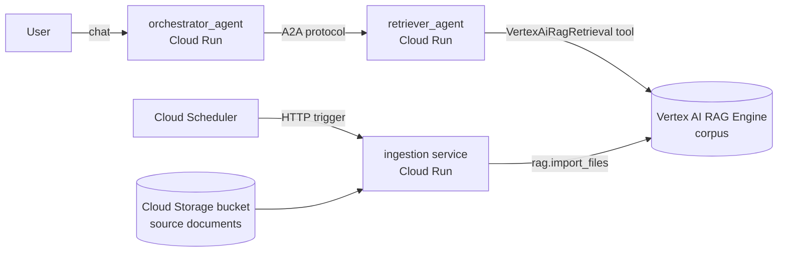

# Google AI Agent Playground

A hands-on sample project for learning the Google AI / Google Cloud agent stack with a
**free/personal developer account**. It wires together the services you asked about into
one small, working multi-agent system:

| Service | Role in this project |
|---|---|
| **Google ADK** (Agent Development Kit) | Builds both agents (`orchestrator_agent`, `retriever_agent`) |
| **Vertex AI (Gemini)** | The LLM that powers each agent |
| **Vertex AI RAG Engine** | Stores an embedded, searchable index ("corpus") of your documents |
| **Google Cloud Storage** | Holds the source documents that get ingested into the RAG corpus |
| **A2A protocol (Agent2Agent)** | `orchestrator_agent` calls `retriever_agent` over the network using A2A, not a plain function call |
| **Cloud Run** | Hosts both agents and the ingestion service as containers |
| **Cloud Scheduler** | Triggers the ingestion service on a schedule to keep the RAG corpus up to date |
| **GitHub Actions** | CI/CD — builds and deploys everything on every push to `master` |

## Architecture



See [docs/ARCHITECTURE.md](docs/ARCHITECTURE.md) for the full explanation of *why* it is
built this way, and [docs/SETUP.md](docs/SETUP.md) for the step-by-step guide to running
this with your own free Google Cloud developer account, including how to wire up
GitHub Actions to auto-deploy the agents.

## Repository layout

```
agents/
  orchestrator_agent/   # Public-facing agent, delegates to retriever_agent via A2A
  retriever_agent/      # Answers questions using the Vertex AI RAG Engine corpus
ingestion/               # Cloud Run service that (re)builds the RAG corpus from GCS
data/sample_docs/        # Example documents uploaded to GCS and ingested into RAG
infra/                   # One-time gcloud setup scripts (APIs, bucket, WIF for CI/CD)
.github/workflows/       # GitHub Actions pipeline that deploys everything
docs/                    # Architecture + setup documentation
```

## Recommended learning path

1. Read [docs/SETUP.md](docs/SETUP.md) and create a free Google Cloud project.
2. Run everything **locally first** (`adk web`) to see the agents work before touching Cloud Run.
3. Manually deploy once with `gcloud` so you understand what is happening.
4. Configure the GitHub Actions secrets/variables and let CI/CD take over future deploys.

## Quick local start

```powershell
cd agents/retriever_agent
python -m venv .venv; .venv\Scripts\Activate.ps1
pip install -r requirements.txt
$env:GOOGLE_CLOUD_PROJECT="your-project-id"
$env:GOOGLE_CLOUD_LOCATION="us-central1"
$env:GOOGLE_GENAI_USE_VERTEXAI="true"
$env:RAG_CORPUS="projects/your-project-id/locations/us-central1/ragCorpora/your-corpus-id"
adk web .
```

Full instructions (including running the orchestrator + A2A locally) are in
[docs/SETUP.md](docs/SETUP.md).